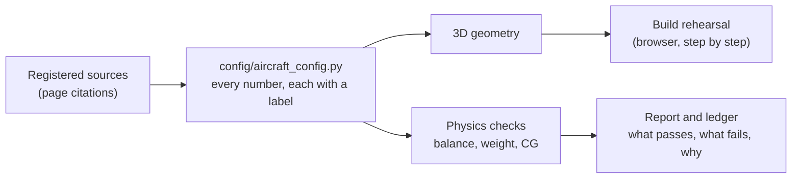

# open-ez

[](https://www.python.org/downloads/)
[](LICENSE)

> **Safety notice.** This repository holds fabrication aids and study material for an
> amateur-built aircraft. It is not certified engineering data, and nothing in it has been
> validated against hardware or in flight. Several values are known to be unsourced or in
> conflict with the book (listed in the Block 1 report). If you build anything from it, you are
> responsible for checking every dimension, load and number against the plans and independent
> sources. Mistakes in aircraft geometry or structure can kill people.

> **Copyright.** The Long-EZ plans remain under copyright and are not in this repository. This
> repo holds its own code and its own words: no plans pages, scans or OCR text, and it cites the
> book by page number instead of quoting it. To follow the build you need your own copy of the plans.

## What this is

open-ez is a software model of the Rutan Long-EZ, a homebuilt canard airplane, written as code
instead of drawn on paper. From that model it makes a 3D "build rehearsal" you can step through in a
browser, chapter by chapter, and it runs basic checks on whether the airplane balances and weighs
what the manual says it should.

Try the rehearsal: **[sternryan.github.io/open-ez](https://sternryan.github.io/open-ez/)**. No install needed.

It is built largely with AI coding agents working under the owner's direction; the agents' working
logs are kept in `docs/harness/`.

## Why it exists

The project started from another open-source Long-EZ model. When we checked it, some of its
numbers had been fitted to hit a published answer, and others had no source at all. A model like
that can agree with the book and still be wrong. So we re-planned in September 2026 around one
rule: every number must point to a page in a registered source, or be visibly marked as not
sourced. The longer goal is to build a Long-EZ that keeps the original shape, weights and balance
(so decades of fleet history still apply) but is made differently: 3D-printed plugs, molds, carbon fiber.

## How it works



Every dimension and weight lives in one file, and each carries a label: taken from a book page,
calculated from such values, corrected by a later Canard Pusher newsletter (`cp-corrected`), or
flagged as in conflict, unsourced, or converted between station frames without a check. The 3D parts and the physics
checks are both built from that file, so they cannot quietly disagree about the airplane. The
rehearsal replays the book's construction chapters on the 3D model. The checks work out where the
airplane balances, in two independent ways that must agree. More in [`docs/how-it-works.md`](docs/how-it-works.md).

## The approach

- **Every number has a receipt.** A value cites a registered source page or is flagged. Why: a number
  you cannot trace is a guess, and in an airplane a guess can kill someone.
- **Failing on purpose is a feature.** When the model disagrees with the book, the test stays red and
  the gap is logged in [`docs/geometry-correction-ledger.md`](docs/geometry-correction-ledger.md); we
  do not tune the model until it passes. Why: a green check you tuned yourself proves nothing, and
  the visible gap tells you what to go and find out.
- **Two ways to get the same answer.** The balance point is computed by a hand formula and by
  VSPAERO, a free NASA-origin solver that works it out from a 3D model of the wings, and the two must agree. Why: one method can hide its own mistakes.
- **Same airplane, new process.** Keep the outer shape, weights and balance range; change how it is
  made. Why: proven aerodynamics and handling carry over, and the thing to prove shrinks to "the new
  structure is at least as strong and does not change how it flies".
- **Rehearse before you build.** Walk the whole book build in software first. Why: the lessons from
  that walk become the requirements for the new process.

## Status

**Shipped**
- A single-file configuration where every geometry value is sourced or flagged (Block 1, baseline
  truth). It is done in the sense that every value is labelled, not in the sense that everything
  agrees; the open items and the evidence that would clear each are in [`docs/block1-report.md`](docs/block1-report.md).
- A browser build rehearsal covering most of the book's construction chapters, with layup cutaways
  and load paths. It is published at the link above.
- A part-by-part mass ledger and an early engine module.

**Known failing, on purpose.** The two-method balance-point check and the weight and CG checks fail
against the book today. The Block 1 report explains each and what would fix it. The canard uses the original (GU) canard's size, with the Roncz airfoil, because no source for the Roncz canard's size has been found.

**In progress.** Block 2: finishing the rehearsal and closing the mass ledger on the manual's sample
empty airplane. Open items are in [`TODOS.md`](TODOS.md).

**Planned, design only.** Blocks 3 to 7: an equivalence engine, printed plugs and molds, physical
test coupons and outside review, engine and systems, and a build and flight-test plan. See the
[roadmap](docs/superpowers/specs/2026-09-29-roadmap-same-airplane-new-process-design.md).

**Not done:** nothing here has been checked against hardware. The CNC cutting paths have never run
on a machine and no part has been built from these files.

## Glossary

- **Long-EZ:** a two-seat canard homebuilt airplane designed by Burt Rutan.
- **Canard:** the small forward wing. On this airplane it carries part of the lift and does the pitch control.
- **Neutral point (NP):** the balance point for pitch stability. With the center of gravity ahead of it, the nose returns after a disturbance (stable); behind it, the disturbance grows.
- **Static margin:** how far ahead of the neutral point the center of gravity sits. More margin, more stable.
- **CG (center of gravity):** where the airplane balances. It has a safe range.
- **FS (fuselage station):** a distance, in inches, measured along the airplane from the plans' reference datum.
- **Provenance:** the label on a number saying where it came from, or that it has no source.
- **Strict xfail:** a test expected to fail. If it ever starts passing the suite turns red too, so a change that silently "fixes" a gap gets noticed and the ledger gets updated.
- **VSPAERO:** free NASA-origin software (OpenVSP's solver). It computes the balance point from a 3D model of the wings, as an independent cross-check on the hand formula.
- **Mass ledger:** a part-by-part list of weights and positions that should add up to the manual's sample empty airplane.

## Go deeper

| If you want to know... | Read... |
|---|---|
| How the pieces fit, in plain words | [`docs/how-it-works.md`](docs/how-it-works.md) |
| What is true and what is still unsourced today | [`docs/block1-report.md`](docs/block1-report.md) |
| Every test that moved when the geometry was corrected, and why | [`docs/geometry-correction-ledger.md`](docs/geometry-correction-ledger.md) |
| Where the project is going | [roadmap](docs/superpowers/specs/2026-09-29-roadmap-same-airplane-new-process-design.md) |
| What is being worked on next | [`TODOS.md`](TODOS.md), [Block 2 design](docs/superpowers/specs/2026-09-30-block2-rehearsal-design.md) |
| Which documents values may cite | `data/sources/registry.yaml`, `data/mass_ledger.yaml` |
| Lessons learned along the way | [`docs/learnings.md`](docs/learnings.md) |
| How the AI agents worked | `docs/harness/` |
| Retired planning documents | [`docs/history/`](docs/history/README.md) |
| The sourcing rules every contributor follows | [`AGENTS.md`](AGENTS.md) |

## Run it yourself

Needs Python 3.11 or newer, and Node 20 or newer for the 3D lab. Full steps, tests and the optional
remote tooling are in [`docs/development.md`](docs/development.md). In short:

```bash
git clone https://github.com/sternryan/open-ez.git && cd open-ez
python3 -m venv .venv
.venv/bin/pip install -r requirements.txt -r requirements-dev.txt -r requirements-guide-dev.txt
.venv/bin/python -m pytest -q
```

Contributions and issues are welcome; read [`AGENTS.md`](AGENTS.md) first.

## License

Apache License 2.0; see [LICENSE](LICENSE). The visual style and parts of the 3D lab are adapted from
the MIT-licensed airsup-lab; third-party code and its license are listed in [NOTICE](NOTICE).
